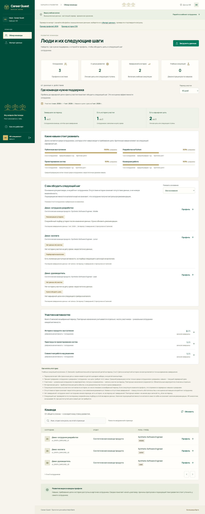

# Career Quest — итоговая доработка и проверка

Дата: **23 сентября 2026**. Основание: [исходное ТЗ](requirements/original-spec.txt), кейс Career Quest. Обязательный сценарий реализован и проверен совместно: сотрудник получает объяснимые AI-рекомендации, завершает активность, видит пересчитанные навыки и прогресс; HR видит дефициты, отсутствие актуального шага и участие. Два дефекта предыдущей общей версии исправлены.

Проверенный runtime: **`62c689de56c3752a512c236c133b3a0176c2762d`**, ветка `codex/tz-ready`. Основа — общая `feat/product-ready` (`fa4c7ad`), дополненная актуальной AI-веткой `db41961` и backend-записью `0b609ec`. Последующие изменения отчёта, README и журнала не меняют runtime. По последнему прямому поручению пользователя готовая версия публикуется непосредственно в **main** обычным push без force. Публичный deploy не выполнялся.

## Что уже работает

| Требование ТЗ | Реализация и подтверждение |
|---|---|
| Профиль и траектория | Роль/грейд, явная цель или следующая ступень, текущие навыки, разрывы, история и допустимые активности. Все 200 профилей исходного кита прошли серверную валидацию офлайн. |
| 1–3 AI-рекомендации | Backend отбирает допустимых кандидатов; OpenAI выбирает ID в подготовленном контексте. Проверка запрещает посторонние ID и неподтверждённые основания. Новая live-серия: 9/9; отдельный UI-вызов: 3 карточки. |
| Объяснение минимум по трём факторам | Цель/грейд, разрыв навыка, история участия, требования и доступность связаны с evidence. Критичность цели и история конкретного события/формата передаются раздельно. Пользовательский текст строится из проверенных фактов. |
| Обновление прогресса | Preview не пишет данные. Completion применяет gain/max_level на сервере, сохраняет историю и новую revision. В браузере: Systems 2 → 3, прогресс 56,25% → 62,5%. Точный повтор не начисляет рост повторно. |
| Простой HR-view | Частота дефицитов с явным знаменателем, сотрудники без актуального шага с причинами, участие/статусы по активности. Расчёт читает профиль и сохранённые рекомендации в одном срезе БД. |
| Проверочные профили жюри | Совместный JSON профилей + CSV истории: preview → commit. Неверная строка отменяет всю партию. Для формата кита нужен частный сервер с исходным каталогом; public-примеры используют собственные ID. |
| Приватность и роли | Серверные employee/HR права, Origin/CSRF, закрытые чужие профили. Public-сессии имеют независимые синтетические базы. Публичных рейтингов сотрудников нет. |
| Запуск одной командой | После настройки ключа `docker compose --env-file .env -f compose.public.yaml up --build` запускает UI+API на localhost:8080 с собственными учебными данными. Проверено из чистого Git-экспорта. Частная база требует однократного импорта и создания accounts. |

Порядок запуска — [README](../README.md), частные данные и учётные записи — [HANDOFF](HANDOFF.md), последовательность защиты — [JURY](../frontend/JURY.md). Критерии оценки в документах приведены к первичному ТЗ: **25 + 25 + 25 + 15 + 10**. Баллы проекту самостоятельно не присваиваются.

## Исправления финальной версии

**HR больше не принимает наличие каталога за наличие рекомендации.** При полезных допустимых кандидатах учитывается последний сохранённый подбор: `recommendation_missing`, `recommendation_stale`, `recommendation_unavailable`, `ai_not_configured`. Сохраняются причины отсутствия цели/кандидатов; достигнутая цель не требует нового шага. UI показывает понятные причины и фильтры. В настоящем браузере проверена цепочка: нет подбора → успешные карточки снимают причину → completion делает результат устаревшим и возвращает соответствующую причину HR.

**Исчерпанная public-квота не ломает точный повтор completion.** Права, Origin и CSRF проверяются до результата. В транзакции сначала ищется сохранённая операция; квота расходуется только для новой. Настоящий HTTP через Docker подтвердил: квота 99 → первое завершение 200 → квота 100 → точный повтор 200 с идентичным ответом. Другое тело с прежним ключом даёт 409, новая операция — 429. История увеличилась ровно на одну запись, revision 1 → 2. Отдельно проверены concurrency, изоляция, права и logout на лимите.

CI дополнен frontend tests/build/format, проверкой сгенерированных типов и явным запуском backend/AI handoff-тестов. GitHub billing lock остаётся внешним ограничением; локальные проверки не объявляются выполненными GitHub jobs.

## Фактические проверки

| Проверка | Результат |
|---|---|
| `make check` | 21 dataset unittest + **538 backend/AI pytest** + 9 групп schema/fixture checks + Ruff — PASS |
| `pytest backend/tests/oleg_backend_handoff_acceptance.py -q` | **19 PASS**, запускаются отдельно от обычного discovery |
| `pnpm --dir frontend test` | **69 PASS** |
| Frontend build / format / OpenAPI types | TypeScript/Vite, Prettier, генерация типов без расхождений — PASS |
| `scripts/smoke.py --ai` | Настоящий TCP, два запуска, сессия → рекомендации → completion → restart → replay/latest stale; remote selector подменён только в тесте |
| `scripts/check_container.py --require-ai` | Linux ARM64 build; UI/assets; non-root; allowlist; отсутствие ключа/кита в образе; импорт AI; права; SQLite/session/replay после пересоздания контейнера с private volume — PASS |
| Чистый public Docker + браузер | Настоящий AI, completion, HR, сохранение после restart, раздельные посетители и импорт — PASS |
| Public quota через HTTP | Первый completion 6,51 ms; точный повтор 2,95 ms; 409/429/403 и logout на лимите — PASS |

Локальная среда: macOS ARM64, Python 3.12.11, Node 22.14.0, pnpm 11.19.0; сборка Docker использовала Python 3.12.14, Node 24 и pnpm 11.25.0. Единственное предупреждение полного Python-прогона — существующая deprecation Starlette/httpx; падений не было. В CI зафиксированы Node 24 / pnpm 11.25.0.

### Настоящий AI на собственных данных

Запущено:

```sh
.venv/bin/python -m backend.app.ai.latency_evaluation --live --env-file .env --rounds 3
```

Модель: `gpt-4.1-mini-2025-04-14`; неизменённый prompt `career-quest-selection-v1`; внутренний deadline 6 s. Все контексты построены через synthetic source import → SQLite → штатный `CareerService._context`. Ожидаемые ответы и рубрика модели не передавались.

| Сценарий | Результат |
|---|---|
| Критичный навык цели против самого низкого некритичного | 3/3 |
| Повторные пропуски формата при наличии альтернативы | 3/3 |
| Отсутствие истории без выдуманных предпочтений | 3/3 |

Все 9 попыток успешны: медиана **1280,26 ms**, максимум/выборочный p95 **3272,31 ms**. Эти измерения включают AI entry point, но исключают подготовку HTTP/UI. Полные безопасные результаты, synthetic IDs и хеши — [final-live-ai.json](verification/final-live-ai.json). Отдельный вызов **браузер → Docker → OpenAI → UI** вернул `ok/oleg`, три карточки за **1693 ms**; он не включён в девять запусков рубрики.

Неуспешные исторические попытки не удалены: в предыдущей общей версии наблюдался timeout **6074 ms**, затем ручной повтор **2034 ms**; см. [PRODUCT_REPORT](../backend/app/ai/PRODUCT_REPORT.md). Новая серия не доказывает постоянную доступность провайдера и не отменяет прежний сбой. При ошибке возвращается недоступность, без подстановки заранее готового выбора.

### Браузер и данные после завершения

Чистый экспорт commit `62c689d` собран одной Compose-командой без копирования рабочей `.env`, исходного кита или локальных БД в build context. Разрешённый ключ передан только в runtime. Проверено:

1. HR открывается, исходный сотрудник имеет причину «Подбор ещё не выполнен». Одна локальная проверка перехода до видимого HR-экрана — **114 ms**.
2. Сотрудник получает настоящий подбор, HR больше не считает его без актуального шага.
3. Preview показывает Systems 2 → 3. Обычное завершение вымышленной активности сохраняет один новый факт; режим симуляции не выбран.
4. UI показывает **62,5%** вместо **56,25%**; revision **1 → 2**, сохранённые карточки `stale=true`. Employee-запрос HR-аналитики получает 403.
5. HR показывает Systems gap **2 → 1**, одно новое участие/завершение и причину «Рекомендация устарела».
6. После настоящего `docker compose restart web` и reload сохранились сессия, revision 2, Systems 3, прогресс 62,5%, три записи истории и три устаревшие карточки. HR читает ту же revision.
7. HR проверен при ширине 1440, 390 и 320 px; на узких экранах document/body не выходят за viewport.



Отдельная HTTP-проверка импорта в двух новых HR-сессиях: примеры JSON/CSV скачиваются; preview не меняет данные; commit добавляет 6 записей и меняет сотрудников **3/3 → 6/3**. Новый профиль доступен первой сессии (200), второй недоступен (404), её revision/аналитика не изменились. Невалидная партия получает 422 без частичной записи. Обе проверочные сессии успешно вышли. AI при импорте не вызывался.

### Исходный кит — только офлайн

Проверен локальный оригинал четырёх файлов, без сети, с отключённым AI и временной БД. Исходные хеши до/после совпали. Импорт: **3075 записей** = 60 навыков + 32 role profiles + 40 событий + 200 сотрудников + 2743 записи истории, revision 1. Повторный импорт: 0 изменений, revision остаётся 1.

Валидны все **200** `EmployeeDetailResponse` и HR-ответ: 200 сотрудников, 190 целей, 200 с историей; за 90 дней — 223 записи, 94 сотрудника с завершением, 0 симуляций. 60 строк дефицитов и 38 строк участия. При отсутствии сохранённых подборов: 159 `recommendation_missing`, 31 `no_candidates`, 10 `no_target`; дополнительные сигналы истории не оценивают мотивацию.

Пять локальных расчётов HR с валидацией: медиана **265,64 ms**, максимум **266,29 ms**. Это время серверной проекции, не полное время UI. Ноль AI-вызовов и сохранённых рекомендаций; содержимое записей кита в Git/отчёт/провайдер не передавалось.

## Границы подтверждённого результата

- Обязательные функции проверены; скрытые профили жюри заранее неизвестны. Для их импорта нужны совместимые каталоги и частная среда из HANDOFF. Изменение уже существующего employee_id/record_id не является заменой записи: конфликт отклоняется, новые записи добавляются.
- ТЗ задаёт UI ≤ 2 s и AI ≤ 10 s. Приведённые измерения укладываются в лимиты на этой машине; малая последовательная выборка не подтверждает SLA под нагрузкой. Внешний AI может завершиться ошибкой или timeout.
- GitHub Actions не стартовал в предыдущих проверках из-за billing lock организации. Этот отчёт содержит локальные результаты; состояние нового run после push нужно оценивать отдельно. Разблокировать billing должен владелец GitHub-организации.
- Проверены macOS ARM64 и Docker Linux ARM64. AMD64, production-нагрузка, долговременная эксплуатация и публичный хостинг не проверялись. Public-данные временные; сохранение после restart не означает сохранение после удаления контейнера. Private Docker использует постоянный volume.
- Live-AI использовал только собственные вымышленные данные. Проверка исходного кита была полностью локальной. Временные проверочные контейнеры/сессии удалены адресно после приёмки; пользовательский ключ и исходные данные сохранены в прежнем локальном расположении.

Дополнительные баллы, награды, прогноз оттока и полная локализация не выдаются за готовые функции. В репозитории сохранены ТЗ, архитектура, контракты, тесты, воспроизводимые команды и обновляемый [AGENTS.md](../AGENTS.md).
