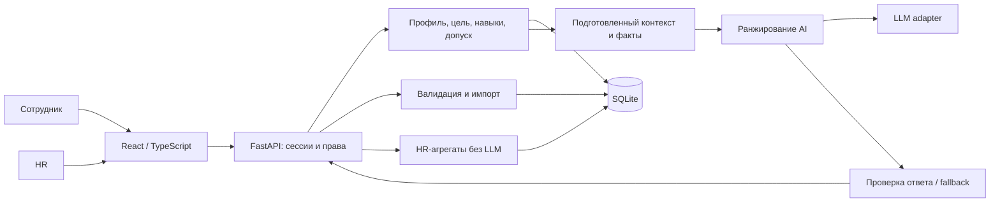

# Архитектура Career Quest

> **Актуальный приоритет (2026-09-23).** Действующие согласованные контракты: [API v1](../contracts/API.md), [AI v1](../contracts/AI_CONTRACT.md); единственные схемы — [backend/app/contracts.py](../backend/app/contracts.py). Изменения [согласованы владельцем задачи](../docs/CONTRACT_CHANGE_PROPOSAL.md). Prefix — `/api`, версия состояния — `state_version` / `expected_state_version`, дата сценария — `scenario_date`; ответ AI — `RecommendationResult`, HTTP-карточки — `RecommendationResponse`. История имеет `date_source`, импорт — один endpoint `/api/hr/import` с preview token, завершение — `/api/employees/{id}/completions` с `Idempotency-Key`. Старые `data_revision`, `/api/v1`, participation endpoints, fallback и дополнительные поля ниже не являются действующим контрактом или обещанием реализации. Проверенные команды и ограничения — [HANDOFF](../docs/HANDOFF.md) и [VERIFICATION](../docs/VERIFICATION.md).

Алихан — backend, данные, API, права, интеграция и деплой (`backend/`, кроме `backend/app/ai/`, общие `contracts/` и инфраструктура); Олег — AI-ядро `backend/app/ai/` и его тесты; Батыр — `frontend/`.

## Историческое предложение

Следующий текст сохранён для контекста проектирования; он не переопределяет ссылки и владельцев выше. Названия таблиц, будущая структура, состояния и приёмочные предложения нужно сверять с действующим кодом и контрактом.

Статус: проект архитектуры v1 от 2026-09-23 для реализации на хакатоне. Приложение, HTTP API, БД и вызов LLM пока не реализованы. Факты о данных: [аудит](data-audit.md). Нормативные требования: [ТЗ](requirements/original-spec.txt) и README стартового кита. Решения ниже — инженерный выбор команды, если явно не сказано обратное.

## 1. Граница продукта

Основной цикл: сотрудник → профиль и цель → 1–3 объяснимых шага → завершение → видимый пересчёт навыков и траектории. HR получает агрегаты пробелов, участия и сотрудников без следующего шага; HR также загружает дополнительные профили и историю жюри. Ядро — качество рекомендации. Валюта, рейтинг, награды, чат, мобильное приложение, прогноз увольнения и Voice Router не входят в MVP. Реальные персональные данные и публичные рейтинги запрещены ТЗ.

Три независимые рабочие зоны:

| Владелец | Модуль | Что передаёт остальным |
|---|---|---|
| Олег: AI | `backend/app/ai/`, собственные тесты | `recommend(context) -> result`; порядок event_id, доказательства, fallback; проверенные demo-сценарии |
| Алихан: Backend / Data | `backend/` кроме `backend/app/ai/`, `contracts/`, инфраструктура | Current skills, trajectory, eligible candidates, факты, HTTP API, транзакции, права |
| Батыр: Frontend / UX | `frontend/` | Кабинет, карточки с основаниями, прогресс, HR, импорт и состояния ожидания/ошибки |

Каталоги модулей — целевая структура; до начала реализации границы закреплены в README соответствующих директорий. Не создавать пустые реализации ради дерева файлов.

## 2. Развёртывание и зависимости

**Модульный монолит**: один backend-процесс, React + TypeScript UI, SQLite в локальном volume, один интерфейс LLM-провайдера. Сборка React раздаётся backend под тем же origin; в dev используется Vite proxy `/api`. Бизнес-правила не дублируются в браузере или prompt.

Выбор технологий:

- Python/FastAPI + Pydantic: удобный общий язык для правил, импорта и AI, HTTP-модели и генерация OpenAPI ([документация FastAPI](https://fastapi.tiangolo.com/features/)).
- React/TypeScript + Vite: один SPA, типы клиента из OpenAPI после реализации backend. Для первой интеграции — согласованный пример ответа, не отдельная бизнес-логика в UI.
- SQLAlchemy 2 + Alembic как план доступа к данным и миграций. SQLite для одного экземпляра и малого объёма; `foreign_keys=ON`, WAL, короткие write-транзакции, `busy_timeout`. Никогда не держать транзакцию во время LLM-вызова. Ограничение конкурентной записи — основание перехода на PostgreSQL при масштабировании ([SQLite](https://www.sqlite.org/whentouse.html)).
- LLM через adapter с поддержкой структурированного ответа. Провайдер и модель конфигурируются; конкретная модель выбирается по качеству трёх сценариев и задержке. Не нужны vector DB, RAG, fine-tuning, Celery, Kafka или цепочка автономных агентов для 40 событий.

Целевой запуск готового приложения: `docker compose up --build`, persistent volume для БД, healthcheck `/api/v1/health`, миграции до готовности сервера. Эта команда **пока не реализована**. Текущие рабочие команды анализа указаны в корневом README. Зависимости приложения фиксируются lock-файлами при реализации, а не предположительными номерами версий в этой записке.

## 3. Домен: детерминированные правила

### Время и восстановление навыков

В demo используется `as_of_date=2026-10-01` из `meta.as_of_date`, а не часы ноутбука. В обычном режиме источник времени заменяемый; во всех ответах показываем дату среза. Несогласованные даты среза трёх JSON — ошибка импорта, не скрытый выбор одного файла.

Для каждого навыка:

1. Baseline — `employees.skills` на `last_review_date`; отсутствующий навык равен 0 (правило кита).
2. Для восстановления добавляем только `status=completed`, где `last_review_date < date <= as_of_date`, в порядке `(date, record_id)`. Строки до/в дату оценки не начисляем снова.
3. Применяем **к каждому завершению**: `new = current + max(0, min(gain, max_level-current, 5-current))`. Это не снижает уже более высокий уровень. Начисление ниже cap и повторный replay проверяются тестами.
4. Новые завершения сохраняем как факты участия; read model пересчитывается из baseline + истории, либо обновляется в той же транзакции. Не изменяем baseline при обычном завершении.

У CSV нет `completed_at`: `date` — дата сессии/зачисления, не доказательство реальной даты завершения. Для импортированной истории принимаем её как **приближение даты завершения**; явно сохраняем `completion_time_source=imported_date_proxy`. Новая история приложения использует настоящий `completed_at` и доменную дату по timezone Asia/Almaty. В фиксированном demo дата завершения — дата среза, а wall-clock timestamp пишется отдельно в audit log. Экспорт в исходную CSV-схему теряет эту точность; round-trip без потерь не обещаем.

Импорт новой оценки заменяет baseline только явно и с проверкой revision; прогресс полностью пересчитывается по новой `last_review_date`. Записи completed до review продолжают исключать уже пройденные неповторяемые добровольные события, хотя не дают новый gain.

Аудит нашёл 544 повторные попытки обязательных EV_001/EV_002/EV_003 после completed (474 completed и 70 overdue), несмотря на общее правило неповторяемости в README. Импорт сохраняет все эти записи по record_id; ограничение неповторяемости применяется к добровольным рекомендациям/завершениям. Нельзя дедуплицировать всю историю по employee_id+event_id.

### Цель, пробелы и траектория

- Явная `career_goal` задаёт target `(role, grade)`, если он существует; иначе ошибка валидации. При отсутствии цели берём следующий грейд своей роли: Junior → Middle → Senior → Lead.
- Lead без цели: `target=null`, `planning_state=no_target`; UI предлагает задать цель и отдельно показывает каталог. Не выдумываем грейд выше Lead.
- Для смены роли цель влияет на требуемые навыки; формальные `target_roles` мероприятия проверяем по **текущей роли**. Нельзя автоматически обойти аудиторию события желаемой ролью; отсутствие пути честно видно HR.
- `gap(s)=max(0, target_required(s)-current(s))`. `critical_skills` целевого профиля приоритетны. Минимальный навык вне цели сам по себе не определяет рекомендацию.
- Readiness: `100 * sum(min(current(s), required(s))) / sum(required(s))` по требуемым навыкам цели. При пустых/нулевых требованиях — `null`, не деление на ноль. Дополнительно показываем число закрытых требований и критические пробелы.
- Это измеритель соответствия выбранному профилю, **не вероятность повышения и не обещание нового грейда**. Грейд автоматически не меняется. При всех gap=0 — `target_satisfied`, предлагается обсуждение следующей цели.

### Допуск мероприятий до вызова AI

Событие может попасть в recommendations только если одновременно:

- `mandatory=false`;
- текущие role и grade входят в `target_roles` и `target_grades`;
- все prerequisites выполнены по восстановленным навыкам;
- self_paced доступно всегда, у scheduled есть сессия `>= as_of_date`;
- оно не завершено ранее; исключение `EV_036` (правило кита, вынести в policy config);
- нет уже активного участия; для повторяемого клуба ещё не завершена выбранная сессия;
- есть положительный фактический прирост хотя бы по одному целевому пробелу.

Предпочтение online у remote, длительность и история отказов/пропусков — мягкие сигналы ранжирования; датасет не содержит географии/календаря и не позволяет доказать физическую невозможность offline. `no_show` и `declined` не трактуются как запрет или черта личности. Для запущенного `in_progress` показываем отдельное «Продолжить», не повторную рекомендацию.

Доступность каталога и полезность для цели — разные поля. Событие без gain может быть доступно в каталоге, но не заполняет рекомендацию. Если подходящих событий 0, возвращаем пустой список с причиной; если 1–2 — не добавляем лишние ради числа 3.

## 4. AI и объяснимость

Модуль Олега получает готовый контекст без БД и HTTP: [спецификация AI](ai-recommendations.md), [JSON Schema](../contracts/recommendation-context.schema.json). Backend уже вычислил gaps, ожидаемые gain и факты участия. LLM выбирает порядок допустимых ID и evidence IDs; сервер проверяет membership, уникальность, ranks, revision и ≥3 категории оснований для каждой карточки.

Текст объяснения сервер собирает из доверенных фактов. Отсутствие истории — факт отсутствия, а не выдуманные «две активности в срок». В наборе данных нет timestamp фактического завершения, поэтому утверждения «завершено вовремя» для таких строк не подтверждены. История помогает выбирать формат и приоритет, но не делает выводы о трудолюбии.

На отказ провайдера, таймаут или некорректный ответ срабатывает многофакторный deterministic fallback; UI получает `source=fallback` и причину. Это устойчивость демо, а не доказательство выполнения AI must-have: отдельный live-тест подтверждает реальную работу модели. Формат JSON сам по себе не гарантирует истинность ответа; семантический validator обязателен даже при constrained decoding ([пример Structured Outputs](https://developers.openai.com/api/docs/guides/structured-outputs)).

Кэш ключ: `employee_id + data_revision + policy_version + prompt_version + model + locale + as_of_date`. Каждое изменение данных увеличивает глобальную revision (для 200 сотрудников это проще зависимостей), инвалидирует кэш и помечает прошлые рекомендации stale. Revision проверяется ещё раз после ответа LLM. При изменении контекста вернуть `409 context_stale`, не показывать устаревший результат как действующий.

SLA: профиль/завершение/HR целевой p95 <2 s локального сценария, AI полный запрос <10 s. Один LLM-вызов с бюджетом до 7 s; ~1 s на подготовку и проверку, fallback внутри общего deadline 9.5 s. Никаких неконтролируемых retry. Профиль отрисовывается сразу, рекомендация загружается отдельно; измеряем холодный и повторный запросы, cache hit не подменяет live latency.

## 5. Запись участия и импорт

Выбор/начало активности создаёт participation со status `in_progress`; завершение меняет эту запись, а не создаёт ещё один gain. Повторяемая активность различается session_date. Команда завершения проверяет принадлежность сотруднику, допустимость перехода, revision, session date не в будущем и `Idempotency-Key`. Неповторяемость и уникальность participation — ограничения БД плюс проверка сервиса, а не кнопка disabled.

Сначала auth и проверка владельца, затем поиск idempotency key: тот же ключ+тело возвращает сохранённый ответ до проверки revision; другое тело — 409. Для нового ключа транзакция: прочитать revision → проверить переход → обновить участие → пересчитать projection → увеличить revision → записать idempotency result → commit. Уникальный ключ в БД и write-транзакция закрывают гонку двух одинаковых запросов. Два разных ключа на одно участие также не удваивают gain. Для импортированной истории жёсткий ключ — source record_id. Совпадение `(employee_id,event_id,date)` у разных record_id — предупреждение для preview, не автоматическое удаление или запрет: кит не гарантирует уникальность тройки. Для новых действий приложения session identity и запрет повторного завершения проверяются отдельно.

Импорт HR двухфазный: [валидация → preview → atomic commit](api-contract.md). Принимаем фактические обёртки JSON из кита, UTF-8 BOM и CSV с точными колонками. История проверяется против объединения существующих и загружаемых профилей. По умолчанию additive merge новых ID; тот же ID с тем же содержимым — no-op, с другим — конфликт. Исправления профиля/истории требуют явного `replace_selected` и base revision. Удаления отсутствующих строк нет. Проверяются FK, даты, enums, диапазоны, manager, role/grade, skills и target. Ошибки по строкам возвращаются до любых изменений.

В MVP каталоги events/skills загружаются при bootstrap; endpoint жюри принимает employees+history. При изменении каталога нужен новый dataset version и полный пересчёт. Не переигрываем доступность прошедших событий по текущему грейду: история могла соответствовать предыдущему грейду; сейчас данных об этом нет.

## 6. Хранение и права

Логическая модель: [data-model.md](data-model.md). JSON/CSV — транспортные форматы, не рабочая БД. Сырые файлы неизменяемы; import batch хранит checksum, version, счётчики и ошибки. В Git только код, схемы и агрегированный аудит; локальный набор передаётся команде через разрешённый канал хакатона.

Backend session содержит роль и employee_id; frontend не может назначить себе HR заголовком или request body. Employee читает/изменяет только себя; HR видит организационные агрегаты, каталог, список сотрудников и импорт. Manager из датасета — связь, **не автоматически выданная административная роль**. Экраны/фильтры HR проверяются на сервере.

В demo допустимы заранее выданные серверные учётные записи; переключатель персон без проверки доступен только в явном локальном DEMO_MODE с видимым баннером и bind 127.0.0.1. Обычный запуск: HttpOnly SameSite cookie, проверка Origin/CSRF на запись, пароли/ключи через env, auth rate limit. HR не может редактировать чужое завершение через employee endpoint.

LLM не получает имена, manager_id или всю историю компании: только обезличенный prepared context и минимальные факты. Внешние поля считаются данными и изолируются от инструкций prompt; модель не выполняет инструменты и не пишет БД. Нет логирования секретов и полных профилей. В ТЗ разрешены облачные модели, но данные ограничены хакатоном: выбор провайдера и локального режима фиксируется в README реализации.

## 7. HR: понятные знаменатели

Срез использует те же reconstructed skills/target rules, что кабинет. По навыку: число сотрудников с gap>0 / число сотрудников, для которых этот навык требуется выбранной целью. Без цели исключаются из этого знаменателя и показываются отдельно. Средний gap считается по дефицитным сотрудникам; оба счётчика возвращаются.

Участие: число записей каждого статуса и число уникальных сотрудников по event за явный период; completion rate = completed / все строки участия в этом периоде (включая in_progress), подпись обязательна. Можно отдельно добавить resolved completion rate, но не смешивать метрики.

«Нет рекомендованного шага» вычисляется правилами для каждого сотрудника без 200 LLM-вызовов. Причины: no_target, target_satisfied, no_candidates; отдельно статусы not_generated / stale / provider_error. Ошибка модели не равна отсутствию подходящего события. Никакого публичного ранжирования сотрудников по эффективности.

## 8. Риски и решения, которые ещё нужно подтвердить

1. Нет точной даты исторического завершения: proxy зафиксирован выше; при уточнении организаторов изменить policy и пересчитать всё.
2. Переход на другую роль не даёт допуск к её закрытым событиям; показать catalog gap, не придумывать курс.
3. При отсутствии цели у Lead рекомендательный сценарий требует выбора цели; обязательная проверка произвольного сотрудника всё равно показывает профиль, историю и каталог.
4. Дополнительные профили жюри могут иметь новые IDs и ссылки на уже существующих managers; не зашивать 200 IDs/8 labels в код вместо каталога.
5. Качество AI и SLA пока не измерены: принятие только после [acceptance.md](acceptance.md), включая реальный ответ модели.

Версионные правила расчёта оформляются в `policy_version`; при их изменении обновляются контракты/fixtures, audit, тесты, README и AGENTS.md в одном коммите. План параллельной реализации: [team-plan.md](team-plan.md).
