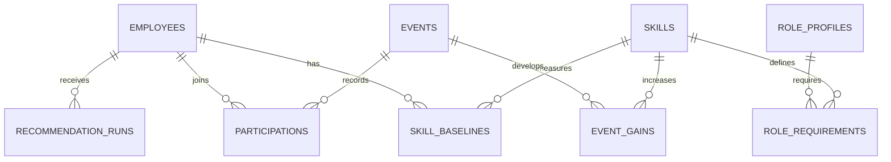

# Модель данных и инварианты

Проект схемы, не применённая SQL-миграция. SQLite для demo, SQLAlchemy/Alembic при реализации. Имена ниже нормативны для обсуждения; миграция и Pydantic-модели должны закрепить их до UI-интеграции.

| Таблица | Ключ / поля | Инвариант |
|---|---|---|
| `dataset_state` | singleton id, dataset_version, as_of_date, revision, policy_version | revision монотонно растёт на commit изменения данных |
| `skills` | skill_id PK, name, type, category, description | type hard/soft; шкала 0–5 |
| `role_profiles` | PK (role, grade), grade_order | порядок Junior/Middle/Senior/Lead задаётся политикой |
| `role_requirements` | PK (role,grade,skill_id), required_level, is_critical | FK на role_profiles и skills; critical — подмножество required |
| `employees` | employee_id PK, full_name, department, role, grade, manager_id nullable, hire_date, tenure_months, work_format, preferred_language, target_role/grade nullable, last_review_date | FK role/grade, target и manager; manager не выдаёт права |
| `employee_skill_baselines` | PK (employee_id,skill_id), level | неизменяемый при завершении baseline на last_review_date; отсутствие строки=0 |
| `events` | event_id PK, title, description, type, format, duration_hours, mandatory, repeatable | repeatable выводится из policy, в исходном JSON поля нет |
| `event_roles`, `event_grades` | PK (event_id,role) / (event_id,grade) | допустимая аудитория |
| `event_gains` | PK (event_id,skill_id), gain, max_level | gain>=0; max_level 0–5 |
| `event_prerequisites` | PK (event_id,skill_id), minimum_level | уровень 0–5 |
| `event_sessions` | PK (event_id,session_date) | только scheduled; self_paced без фиктивных дат |
| `participations` | participation_id PK; source_record_id UNIQUE nullable; employee_id, event_id, session_date/enrolled_date, due_date nullable, status, completion_pct, score nullable, feedback_rating nullable, assigned_by, completed_at nullable, effective_completion_date nullable, completion_time_source | completed → 100%; только completed начисляет gain; source_record_id — импортный ключ; совпадение employee/event/date у разных IDs — warning, не UNIQUE |
| `employee_skill_projection` | PK (employee_id,skill_id), current_level, revision | optional read model; всегда восстановим из baseline+participations |
| `recommendation_runs` | run_id PK, employee_id, context_id, revision, as_of_date, policy/prompt/model versions, locale, status, source, fallback_reason, duration_ms, result_json, explanations_json | result и разрешённые факты объяснений сохраняются вместе; latest возвращает тот же envelope; старый revision не выдаётся как актуальный |
| `import_batches` | batch_id PK, hashes, base_revision, normalized_payload_path, state, expires_at, counters, errors | validation stage не изменяет доменные таблицы; stage виден только создавшему HR |
| `idempotency_results` | PK (actor_id,operation,key), request_hash, response_status, response_json, created_at | одинаковый ключ+тело → тот же ответ; иной hash → 409 |
| `users`, `sessions` | user_id, role employee/hr, employee_id nullable; session_hash, expiry | сервер проверяет actor и scope, raw session token в БД не хранится |
| `audit_log` | id, actor_id, operation, entity_id, wall_clock_at, data_revision, metadata | без API-ключей и полного prompt/profile |

## Связи

## Ограничения и транзакции

- FK и CHECK работают в БД, не только в форме. Связи employee-manager при импорте проверяются по всей staged-партии; для вставки — deferred FK или двухпроходный insert в одной транзакции.
- Не делать UNIQUE(employee_id,event_id) на всей истории: допустимы неудачные попытки, повторяемый EV_036 и обнаруженные аудитом повторные mandatory назначения. Для неповторяемого **добровольного** события максимум одно completed на сотрудника, максимум одно active; для repeatable — максимум одно completed/active на session date. Все mandatory строки импорта сохраняются. `repeatable` проверяется доменным сервисом в сериализованной write-транзакции; если денормализуется в participation, только из event policy, не от клиента.
- Пересчёт сортирует импортированную историю по effective date и record_id; длительность/score не умножают gain. `in_progress` не даёт частичного gain.
- Результат идемпотентной операции сохраняется атомарно с participation и revision; ограничение защищает и от двух разных ключей на одно завершение.
- Stage-импорт проверяет неизвестные skills/events, типы (bool не число), дубликаты ID, диапазоны, даты/grade/enum и конфликты. Весь batch отклоняется при ошибке. Source schema wrapper `meta` сохраняется, не теряется при нормализации.
- Внешние source_record_id не заменяют внутренний participation_id: приложение создаёт свои UUID, импорт сохраняет исходный ID отдельно.
- Индексы: participations(employee_id,effective_completion_date), participations(event_id,status,source_date), recommendation_runs(employee_id,revision), employees(role,grade). Для 2743 строк сначала SQL/простая агрегация, оптимизация после замеров.

## Обновления и восстановление

При import commit/complete меняются состояние + revision; кэш рекомендаций автоматически недействителен. Backup — согласованная копия SQLite через backup API, не копирование открытого db-файла без WAL. Raw kit и stage upload не размещаются под static root. `data/raw/` не очищается миграциями. Команда reset demo должна требовать явный флаг, сохранять исходник и запускаться отдельно от обычного старта.
